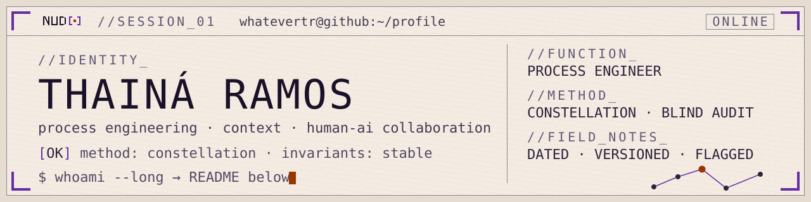

<p align="center">
  <picture>
    <source media="(prefers-color-scheme: dark)" srcset="assets/banner_nud_noite.svg">
    
  </picture>
</p>

```
whatevertr@github:~$ whoami
name        Thainá Ramos
function    Process Engineer · Continuous Improvement
ground      process architecture · data reconciliation · service catalogs
edge        context engineering · human–AI collaboration methods (constellation of roles)
proof       blind-audited inventories · platform PoC via REST API
status      building in public · field notes dated & versioned

whatevertr@github:~$ cat method.json
{
  "roles":      ["author", "thinker", "manager", "worker", "poc-runner"],
  "rules":      ["never overwrite — version", "divergence becomes a flag",
                 "closed scope", "the pair is the key",
                 "flag what I cannot verify"],
  "invariants": "green or it does not ship"
}
```

> 🍷 — the marker for `flag what I cannot verify`: what I notice but cannot confirm.

---

Hi — I'm Thainá, a process engineer, and I build in public here. This profile is the hub for the things I make: some are experiments, some are developments I take further, and some are tools I actually built for my real-life work — both to make art and to do process and continuous-improvement work. I put it all out in the open for two reasons: to document how I'm learning and evolving, and so it can stand as a portfolio for what comes next. Not everything here is polished or finished — I'd rather show the work as it grows than wait for it to be perfect.
